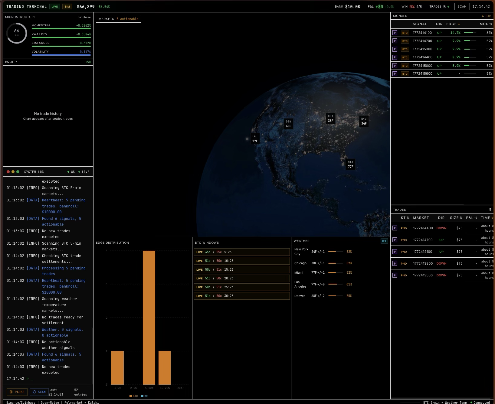

# Polymarket Weather CLOB Bot

An institutional-grade trading bot that identifies pricing inefficiencies in Polymarket weather prediction markets. Uses **ensemble weather forecasting** to trade directly against the **Polymarket Central Limit Order Book (CLOB)**. Features a professional React dashboard.

[](https://python.org)&nbsp;[](https://react.dev)&nbsp;[](https://www.typescriptlang.org/)



## Overview

### Strategy: Weather Temperature
Scans weather temperature markets on **Polymarket** every 5 minutes. Uses 31-member GFS ensemble forecasts from Open-Meteo to estimate the probability of temperature thresholds being exceeded. Trades when edge > 8%.

### Key Features

- **Ensemble Weather Forecasting** - 31-member GFS ensemble from Open-Meteo for probabilistic temperature predictions
- **CLOB Execution Engine** - Direct order placement via `py_clob_client` using FOK/GTC orders
- **Live Order Book Ingestion** - Calculates true mathematical edge against live CLOB mid-prices, not static API data
- **Freshness Guards** - Automatically halts trading on markets with wide spreads (>10c) or thin liquidity
- **Kelly Criterion Sizing** - Fractional Kelly (15%) position sizing with per-trade caps
- **Professional Dashboard** - React dashboard with real-time updates and equity tracking
- **Simulation Mode** - Default paper trading mode with virtual bankroll tracking

## Quick Start

### 1. Backend Setup

```bash
cd polymarkt-weather-bot

# Create virtual environment
python -m venv venv
source venv/bin/activate  # On Windows: venv\Scripts\activate

# Install dependencies
pip install -r requirements.txt

# Configure environment
cp .env.example .env
# Edit .env with your Polymarket CLOB credentials (POLYMARKET_API_KEY, POLYMARKET_SECRET, POLYMARKET_PASSPHRASE)
# Keep SIMULATION_MODE=true until you are ready to trade live

# Run the backend
uvicorn backend.api.main:app --reload --port 8000
```

Backend will be at: http://localhost:8000
API docs at: http://localhost:8000/docs
*Note: API control endpoints require the `X-API-Key` header defined in your configuration.*

### 2. Frontend Setup

```bash
cd frontend

# Install dependencies
npm install

# Run the frontend
npm run dev
```

Frontend will be at: http://localhost:5173

## Architecture

```
┌──────────────────────────────────────────────────────────────────┐
│                          FRONTEND                                │
│  React + TypeScript + TanStack Query + Tailwind                  │
│  ┌──────────┐ ┌──────────┐ ┌──────────┐ ┌──────────┐            │
│  │Weather   │ │ Signals  │ │  Trades  │ │ Control  │            │
│  │  Map     │ │  Grid    │ │  Table   │ │  Panel   │            │
│  └──────────┘ └──────────┘ └──────────┘ └──────────┘            │
└──────────────────────────────────────────────────────────────────┘
                              │ X-API-Key Auth
                              ▼
┌──────────────────────────────────────────────────────────────────┐
│                          BACKEND                                 │
│  FastAPI + Python + SQLite + APScheduler                         │
│  ┌───────────┐ ┌───────────┐ ┌───────────┐ ┌───────────┐        │
│  │ Market    │ │ Book      │ │ Signal    │ │Execution  │        │
│  │ Scanner   │ │ Listener  │ │ Engine    │ │ Engine    │        │
│  └───────────┘ └───────────┘ └───────────┘ └───────────┘        │
└──────────────────────────────────────────────────────────────────┘
                              │
                              ▼
┌──────────────────────────────────────────────────────────────────┐
│                        DATA SOURCES                              │
│  ┌──────────┐ ┌──────────┐ ┌──────────┐ ┌──────────┐            │
│  │Open-Meteo│ │  NWS     │ │Polymarket│ │Polymarket│            │
│  │ Ensemble │ │  API     │ │Gamma API │ │ CLOB L2  │            │
│  └──────────┘ └──────────┘ └──────────┘ └──────────┘            │
└──────────────────────────────────────────────────────────────────┘
```

## How It Works

### Execution Flow
1. **Market Discovery:** Fetch open weather markets from Polymarket (Gamma API).
2. **Token Mapping:** Extract and validate ERC1155 YES/NO Token IDs for the discovered markets.
3. **Forecast Ingestion:** Fetch 31-member GFS ensemble forecasts from Open-Meteo for the target cities.
4. **Probability Modeling:** Count fraction of members above/below the market's temperature threshold (e.g., 28/31 members above 70F = 90% model probability).
5. **Live Pricing:** Ingest the live L2 order book via `py_clob_client` and calculate the true mid-price spread.
6. **Edge Calculation:** Compare model probability to the live CLOB mid-price. Trade when edge > 8%.
7. **Execution:** Place orders via the CLOB execution engine using Fractional Kelly sizing, adhering to liquidity freshness guards.

### Edge Calculation
```
edge = model_probability - live_clob_mid_probability
```
Weather signals require |edge| > 8%.

### Position Sizing (Fractional Kelly)
```
kelly = (win_prob * odds - lose_prob) / odds
position_size = kelly * 0.15 * bankroll
```
Capped at $50 per trade by default.

## Configuration

All settings in `backend/config.py`, overridable via `.env` file:

### API Security
| Setting | Default | Description |
|---------|---------|-------------|
| `API_SECRET_KEY` | change_me_in_production | X-API-Key required for control endpoints |

### Bot Settings
| Setting | Default | Description |
|---------|---------|-------------|
| `SIMULATION_MODE` | True | Paper trading mode |
| `INITIAL_BANKROLL` | 1000.0 | Starting paper bankroll |
| `KELLY_FRACTION` | 0.15 | Fractional Kelly multiplier |

### Polymarket Credentials
| Setting | Default | Description |
|---------|---------|-------------|
| `POLYMARKET_API_KEY` | None | L1 Address / API Key |
| `POLYMARKET_SECRET` | None | Private Key / Secret |
| `POLYMARKET_PASSPHRASE`| None | L1 Passphrase |
| `POLYMARKET_HOST` | https://clob.polymarket.com | CLOB Host |

### Weather Settings
| Setting | Default | Description |
|---------|---------|-------------|
| `WEATHER_SCAN_INTERVAL_SECONDS` | 300 | Weather scan frequency (5 min) |
| `WEATHER_MIN_EDGE_THRESHOLD` | 0.08 | Minimum edge (8%) |
| `WEATHER_MAX_ENTRY_PRICE` | 0.70 | Max entry price (70c) |
| `WEATHER_MAX_TRADE_SIZE` | 50.0 | Max $ per weather trade |
| `WEATHER_CITIES` | nyc,chicago,miami,los_angeles,denver | Cities to track |

### Risk Management
| Setting | Default | Description |
|---------|---------|-------------|
| `DAILY_LOSS_LIMIT` | 100.0 | Daily loss circuit breaker |
| `MAX_TOTAL_PENDING_TRADES` | 20 | Max open positions |

## Supported Cities

| City | Station | Tracked |
|------|---------|---------|
| New York | KNYC | Default |
| Chicago | KORD | Default |
| Miami | KMIA | Default |
| Los Angeles | KLAX | Default |
| Denver | KDEN | Default |

Add more cities by editing `WEATHER_CITIES` in config and adding entries to `CITY_CONFIG` in `backend/data/weather.py`.